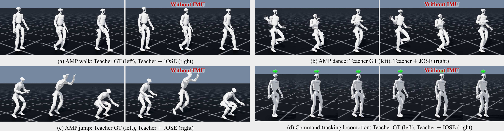
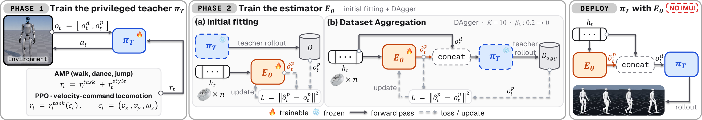

# JOSE: Reconstructing Privileged State from Joint History for Humanoid Motion Control

JOSE trains a Unitree G1 (29 DOF) teacher policy on privileged simulator state,
then trains an estimator that reconstructs that state from a short history of
joint encoders alone. At deployment the estimate replaces the privileged
observation and the teacher runs unchanged.



*Four G1 teachers from this repository: (a) AMP walk, (b) AMP dance, (c) AMP jump
and (d) velocity-command locomotion. In each panel, the left strip shows the teacher
acting on ground-truth privileged observations. The right strip shows the same
teacher with those observations replaced by JOSE's estimate, which is computed from
joint-encoder history alone, without an IMU.*

This repository contains:

- **Four teachers**: AMP walk, AMP jump, AMP dance and a velocity-tracking PPO walk.
- **Three terrain variants** of the PPO walk: randomized friction, slopes and pushes.
- **The JOSE estimator**: a 2-layer LSTM over a 25-step window of all 29 joints,
  trained with DAgger.
- **A teacher rollout with JOSE in the loop**.

## Method overview



JOSE is trained in two phases and then deployed with the teacher frozen. Each
stage maps to one script in this repository.

| Stage | What happens | Script |
|---|---|---|
| **Phase 1: teacher** | The teacher $\pi_T$ is trained on the complete observation $o_t = [o_t^d, o_t^p]$. Here $o_t^d$ is the joint-encoder reading and $o_t^p$ the privileged state: base linear velocity, base angular velocity and projected gravity. The AMP teachers combine a task reward with a style reward; the PPO walk teacher tracks a velocity command $c_t = (v_x, v_y, \omega_z)$. | `train.py`, `train_ppo_walk.py` ([§1](#1-train-a-teacher)) |
| **Phase 2(a): initial fitting** | $\pi_T$ is frozen. Its rollouts fill a dataset $D$, and the estimator $E_\theta$ learns to predict $o_t^p$ from a window $h_t$ of encoder history by minimizing $\lVert \hat{o}_t^p - o_t^p \rVert^2$. | `train_state_estimator.py` ([§2](#2-train-jose)) |
| **Phase 2(b): DAgger** | The frozen teacher runs on $[o_t^d, \hat{o}_t^p]$, the encoders plus JOSE's estimate. The states this visits are labelled with simulator ground truth and aggregated into $D_{agg}$, and $E_\theta$ is refit. This is repeated for $K = 10$ rounds. The teacher's share $\beta_k$ of the rollout falls from 0.2 to 0; the script's `--dagger-est-ratio` flags set the complementary estimator share, from 0.8 to 1.0. | same script |
| **Deployment** | $E_\theta$ turns the encoder history into $\hat{o}_t^p$, and the frozen teacher acts on $[o_t^d, \hat{o}_t^p]$. No IMU is read. | `play_teacher_with_estimator.py` ([§3](#3-run-the-teacher-with-jose-in-the-loop)) |

Training on its own rollouts is the point of phase 2(b). An estimator fitted only to
the teacher's rollouts makes small errors, those errors push the robot into states
the dataset never covered, and there the errors grow. DAgger collects exactly those
states and adds them to the dataset.

## Requirements

| Requirement | Version |
|---|---|
| OS | Linux |
| Python | 3.10+ |
| Isaac Sim | 5.1.x |
| Isaac Lab | 2.3.x+ (provides `skrl` and `rsl-rl-lib`) |
| GPU | CUDA GPU |

The code was developed with Isaac Sim 5.1.0, `isaaclab` 0.54.4, `torch` 2.7.0+cu128,
`rsl-rl-lib` 5.0.1 and `skrl` 2.1.0.

## Installation

Install [Isaac Lab](https://isaac-sim.github.io/IsaacLab/main/source/setup/quickstart.html)
first. Then install this package into the same environment:

```bash
conda activate <your-isaac-lab-env>
git clone https://github.com/edipark/jose-humanoid.git
cd jose-humanoid
python -m pip install -e .
```

Check that the tasks are registered:

```bash
python -c "import jose, gymnasium as gym; print([k for k in gym.registry if 'JOSE' in k])"
```

The robot asset (`usd/`) and the reference motions (`motions/`) are bundled, so
no further download is needed.

## Tasks

| Task ID | Teacher | Trainer |
|---|---|---|
| `Isaac-G1-AMP-Walk-JOSE-Direct-v0` | AMP walk | `train.py` (skrl) |
| `Isaac-G1-AMP-Jump-JOSE-Direct-v0` | AMP jump | `train.py` (skrl) |
| `Isaac-G1-AMP-Dance-JOSE-Direct-v0` | AMP dance | `train.py` (skrl) |
| `Isaac-G1-PPO-Walk-JOSE-v0` | Velocity-tracking walk | `train_ppo_walk.py` (rsl-rl) |
| `Isaac-G1-PPO-Walk-Friction-JOSE-v0` | Walk, friction randomized in [0.3, 1.0] | `train_ppo_walk.py` |
| `Isaac-G1-PPO-Walk-Slope-JOSE-v0` | Walk on pyramid slopes, with a curriculum | `train_ppo_walk.py` |
| `Isaac-G1-PPO-Walk-Push-JOSE-v0` | Walk with random base pushes | `train_ppo_walk.py` |

Each PPO walk task has an `-Estimator-` twin, for example
`Isaac-G1-PPO-Walk-Estimator-JOSE-v0`. The twin adds `base_lin_vel` to the policy
observation so that JOSE has a slot to write its estimate into. Otherwise it is
identical to the base task. Train the teacher on the base task, then train and
run JOSE on the `-Estimator-` twin. The AMP tasks need no twin.

## 1. Train a teacher

### AMP teachers (walk, jump, dance)

```bash
python -m jose.train --task Isaac-G1-AMP-Walk-JOSE-Direct-v0 --algorithm AMP --headless
python -m jose.train --task Isaac-G1-AMP-Jump-JOSE-Direct-v0 --algorithm AMP --headless
python -m jose.train --task Isaac-G1-AMP-Dance-JOSE-Direct-v0 --algorithm AMP --headless
```

Checkpoints are written under `logs/skrl/g1_jose_amp_<motion>/<run>/checkpoints/`.
Useful options: `--num_envs`, `--max_iterations`, `--seed`, `--checkpoint` (to resume)
and `--experiment_name`.

To play an AMP teacher:

```bash
python -m jose.play --task Isaac-G1-AMP-Walk-JOSE-Direct-v0 --algorithm AMP \
  --checkpoint logs/skrl/g1_jose_amp_walk/<run>/checkpoints/best_agent.pt
```

Add `--video --video_length 600 --headless` to record a clip instead of opening
the viewer.

### Velocity-tracking PPO walk

The task is ported from [unitree_rl_lab](https://github.com/unitreerobotics/unitree_rl_lab).
The reward set, the command sampler and the terrain differ from upstream, because
the upstream recipe converged to a policy that stands still.

```bash
python train_ppo_walk.py --task Isaac-G1-PPO-Walk-JOSE-v0 --headless --max_iterations 5000
```

The teachers in the paper were trained for 5000 iterations with 4096 environments
(the config default is 50000 iterations). Checkpoints are written under
`logs/rsl_rl/<task id in snake_case>/<date>/model_<n>.pt`. To check that the stack
works before a full run:

```bash
python train_ppo_walk.py --task Isaac-G1-PPO-Walk-JOSE-v0 --headless \
  --num_envs 64 --max_iterations 5
```

To play the teacher and export it to TorchScript and ONNX:

```bash
python play_ppo_walk.py --task Isaac-G1-PPO-Walk-JOSE-v0 --num_envs 32 \
  --checkpoint logs/rsl_rl/isaac_g1_ppo_walk_jose_v0/<run>/model_4999.pt
```

`Train/mean_reward` does not show whether the policy walks: a robot that stands
still already collects most of the tracking reward. Before training an estimator,
check the teacher with the fixed-command evaluation. It reports tracking error,
survival and gait statistics, and runs six sanity checks:

```bash
python eval_ppo_walk.py --task Isaac-G1-PPO-Walk-JOSE-v0 --headless \
  --checkpoint logs/rsl_rl/isaac_g1_ppo_walk_jose_v0/<run>/model_4999.pt \
  --output teacher_eval.json
```

The recipe marches in place when commanded to stand. Expect the check
`zero command does not lift feet repeatedly` to fail; the other five checks
should pass.

### Terrain variants

The terrain variants use the same recipe and the same budget. Only the task ID
changes:

```bash
python train_ppo_walk.py --task Isaac-G1-PPO-Walk-Friction-JOSE-v0 --headless --max_iterations 5000
python train_ppo_walk.py --task Isaac-G1-PPO-Walk-Slope-JOSE-v0    --headless --max_iterations 5000
python train_ppo_walk.py --task Isaac-G1-PPO-Walk-Push-JOSE-v0     --headless --max_iterations 5000
```

Each variant changes one thing from the flat task:

| Variant | Change | Defined in |
|---|---|---|
| Friction | Robot material friction sampled from [0.3, 1.0] per environment; the ground stays at 1.0 | `ppo_walk/terrain_env_cfg.py` |
| Slope | Pyramid and inverted-pyramid slopes up to 0.4, with a terrain-level curriculum; the fall check is measured relative to the ground | `ppo_walk/terrain_env_cfg.py`, `ppo_walk/mdp/terrain_mdp.py` |
| Push | Base velocity kicks of up to 0.5 m/s at intervals of 1 to 4 s | `ppo_walk/push_env_cfg.py` |

The policy observation is the same 495-dimensional layout in every variant, so
the estimator interface does not change. The slope variant's height scanner feeds
only the reward and the fall check, never the policy. Evaluate and play these
teachers with the commands above; only `--task` changes.

## 2. Train JOSE

`train_state_estimator.py` freezes a teacher, collects rollouts and fits the
estimator. It then runs 10 DAgger rounds. In each round it rolls out with the
estimator in the loop, adds the visited states to the dataset and refits. The
defaults are the JOSE configuration:

| Setting | Default |
|---|---|
| Model | 2-layer LSTM, hidden size 256 (`--estimator LSTM`) |
| History window | 25 steps (`--window 25`) |
| Joints | all 29, positions and velocities (`--joint-preset all`) |
| Target | base linear velocity, base angular velocity, projected gravity (9-D) |
| DAgger | 10 rounds; the estimator's share of the rollout rises linearly from 0.8 to 1.0 |

Velocity-tracking walk (repeat with a terrain variant's `-Estimator-` task and
teacher):

```bash
python -m jose.train_state_estimator \
  --adapter ppo_walk \
  --task Isaac-G1-PPO-Walk-Estimator-JOSE-v0 \
  --teacher-checkpoint logs/rsl_rl/isaac_g1_ppo_walk_jose_v0/<run>/model_4999.pt \
  --run-name walk_jose \
  --headless
```

AMP teachers:

```bash
python -m jose.train_state_estimator \
  --task Isaac-G1-AMP-Walk-JOSE-Direct-v0 \
  --teacher-checkpoint logs/skrl/g1_jose_amp_walk/<run>/checkpoints/best_agent.pt \
  --run-name amp_walk_jose \
  --headless
```

Results are written to `logs/jose_g1/estimators/<run-name>/`:

```text
best_estimator.pt        # the round with the best closed-loop score
estimator_round_<k>.pt   # every round
training.json            # config and final metrics
progress.jsonl           # per-epoch and per-round log
tensorboard/
```

The best round is chosen by closed-loop performance. On the walk tasks that means
command-tracking error; on the AMP tasks it means episode length. Use `--seed` to
change the seed (the paper used 42, 43 and 44). For a quick check of the
pipeline:

```bash
python -m jose.train_state_estimator --adapter ppo_walk \
  --task Isaac-G1-PPO-Walk-Estimator-JOSE-v0 --teacher-checkpoint "$TEACHER" \
  --num-envs 16 --collect-steps 50 --epochs 1 --dagger-rounds 1 --dagger-epochs 1 \
  --eval-episodes 2 --max-episode-steps 50 --run-name smoke --headless
```

## 3. Run the teacher with JOSE in the loop

`play_teacher_with_estimator.py` runs the teacher on JOSE's estimate in place of
the privileged state:

```bash
python -m jose.play_teacher_with_estimator \
  --adapter ppo_walk \
  --task Isaac-G1-PPO-Walk-Estimator-JOSE-v0 \
  --agent rsl_rl_cfg_entry_point \
  --teacher-checkpoint "$TEACHER" \
  --estimator-checkpoint logs/jose_g1/estimators/walk_jose/best_estimator.pt \
  --steps 1000 \
  --csv-output logs/rollout.csv
```

For an AMP teacher, drop `--adapter` and `--agent`, and use the AMP task ID.
Useful options:
- `--video --headless` records a clip under `logs/jose_g1/videos/teacher_estimator/`.
- `--csv-output` writes the actions and estimates for every step.
- `--real-time` runs at wall-clock speed.

## Project layout

```text
jose-humanoid/
├── train.py, play.py                     # AMP teachers (skrl)
├── train_ppo_walk.py, play_ppo_walk.py   # PPO walk teachers (rsl-rl)
├── eval_ppo_walk.py                      # fixed-command teacher check
├── train_state_estimator.py              # JOSE training
├── play_teacher_with_estimator.py        # teacher + JOSE rollout
├── g1_amp_env.py, g1_amp_env_cfg.py      # AMP environments
├── ppo_walk/                             # PPO walk task, terrain variants, rsl-rl glue
├── estimator/                            # estimator models, adapters, DAgger pipeline
├── distillation/                         # sensor-state helpers used by the pipeline
├── agents/                               # skrl AMP configs
├── schema.py, task_math.py               # observation layout and estimate injection
├── teacher_setup.py, skrl_compat.py      # teacher loading
├── tools/                                # rollout diagnostics
├── motions/                              # reference motions and loader
├── usd/                                  # G1 29-DOF asset
└── assets/                               # README figures
```

## License and attribution

This repository builds on [Isaac Lab](https://github.com/isaac-sim/IsaacLab)
(BSD-3-Clause); see [LICENSE](LICENSE).

The G1 asset and motions are adapted from
[linden713/humanoid_amp](https://github.com/linden713/humanoid_amp) (BSD-3-Clause);
see [usd/README.md](usd/README.md).

The velocity-tracking walk task in `ppo_walk/` is ported from
[unitreerobotics/unitree_rl_lab](https://github.com/unitreerobotics/unitree_rl_lab)
(Apache-2.0). Ported files carry a header that names the source.
